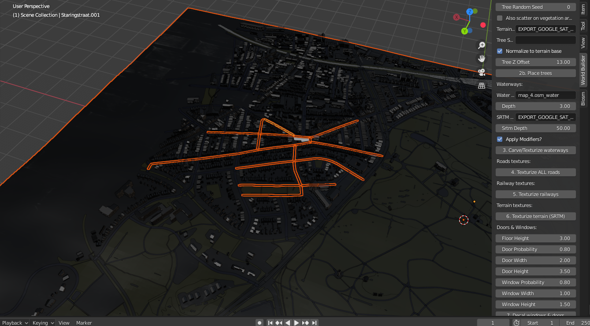

# 3D World Builder

The 3D world builder is a blender plugin to generate and style a 3D world quickly.

> Note: The plugin expect a full 3D world, that was generated with either OSM, Blosm or Blender GIS. If you do not have OSM data, this plugin will be useless.

- It stylizes a (game)world based upon OSM data: texturizes walls, roofs, waterways, greenery, roads, railways.
- It also can generate placeholder trees, decal windows and and doors. 
- It also can "carve" waterways, and solidify all meshes automatically.
- It has a special function to carve out random doors and windows from meshes. 
- It can process (and fully style) 15.000+ "buildings" in less than 10 minutes of a proper CPU/GPU. Which equates to 3-5sq. kilometers of city data.

It also has a headless function, so that it can run blender even faster.



### Requirements

- Blender 2.8.3+
- Python
- Any OS: Tested on Windows and Linux. (Mac is untested.)

### Installation

Import the script into Blender: `edit -> preferences -> addons`

Then click 'N' to open the sidebar, where the World Bar will be visible.

### Texture folders.

The folder structure is what the script expects! do not change it. Simply add your textures to each folder, and the script will sort it out.

### Add your textures into each subfolder.

The script expects textures to be named like:

```

_name_1.png
_name_albedo.png
_name_ao.png
_name_normal.png
_name_height.png

```

etc.

A single background image also works, if you do not want PBR wiring. The script automatically selects it, but it must have underscores in it.

### Headless support.

```
World Builder Headless Usage:
-----------------------------
Usage command: blender -b --factory-startup <blend_file> -P <script> -- <script_args>
-----------------------------
Real world example: 
-----------------------------
blender -b --factory-startup "C:\\Users\\Username\\Desktop\\Game\\Blender\\Test.blend"
-P "C:\\Users\\Username\\Desktop\\Game\\BlenderScripts\\World_Builder.py" --
export_folder="C:\\Users\\Username\\Desktop\\World Builder\\Export"
texture_folder="C:\\Users\\Username\\Desktop\\World Builder\\Textures"
--all=True
-----------------------------
Arguments:
-----------------------------
--export_folder=PATH       : (Required) Folder where export files are saved, e.g. "C:\\Users\\Username\\Desktop\\World Builder\\Export"
--texture_folder=PATH      : (Required) (sub) folder(s) where all texture files are found, e.g. "C:\\Users\\Username\\Desktop\\World Builder\\Textures"
Processing Options:
--all=True, --any=True     : Runs all available methods/functions in sequence, without needing to call them individually.
--process_buildings=True   : Texturizes buildings
--process_openings=True    : Generates random windows, doors and vents on each building (and also cuts out mesh openings.)
--process_roads=True       : Texturizes roads
--process_vegetation=True  : Texturizes vegetation
--process_trees=True       : Scatters placeholder trees across forest/park areas
--process_waterways=True   : Texturizes waterways such as rivers, lakes, etc.
--process_railways=True    : Texturizes railways
-----------------------------
Overrides:
-----------------------------
NOTE: All float units should be in real world meters! most have default values, and rarely needs change.
--solidify=Bool            : Solidifies walls, if True. Default: True.
--wall_thickness=Float     : Thickness of the building walls when script applies SOLIDIFY boolean modifier. Default: 0.15 (15 centimeters in world units)
--tex_width=Float          : Texture width. Default: 2.0 (2048 x 2048 pixels)
--tex_height=Float         : Texture height. Default: 2.0 (2048 x 2048 pixels)
--roof_threshold=Float     : Threshold to automatically detect roofs. Default: 0.85
--floor_height=Float       : Height of individual floors in a building, used to determine window locations. Default: 3.0
--door_prob=Float          : Probability of a door being placed on a processed building. Default: 0.8
--door_width=Float         : Minimal width of generated doors. Default: 2.0
--door_height=Float        : Minimal height of generated doors. Default: 3.5
--window_prob=Float        : Probability of rows of windows being placed on a processed building. Default: 0.8
--window_width=Float       : Minimal width of generated windows. Default: 1.0
--window_height=Float      : Minimal height of generated windows. Default: 1.5
-----------------------------
--help, -h                 : Show this help message
-----------------------------
Tips: You can combine multiple processing options in one command.  
For example, to only process buildings, openings, and roads together:  
--process_buildings=True --process_openings=True --process_roads=True  

Use --all=True to run everything in sequence without specifying each option.
```

---

### Credits
Flaneurette, ChatGPT, Claude.ai in various stages.
